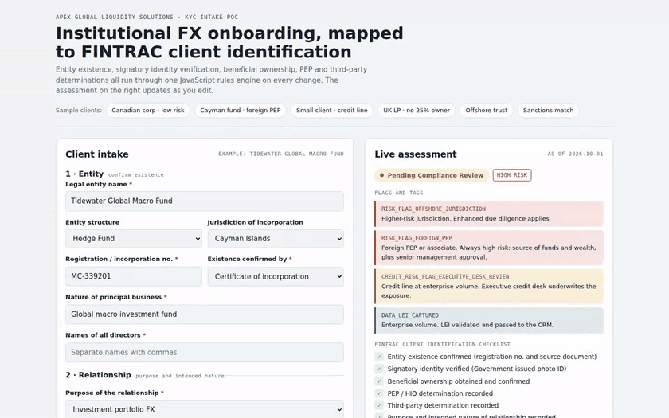
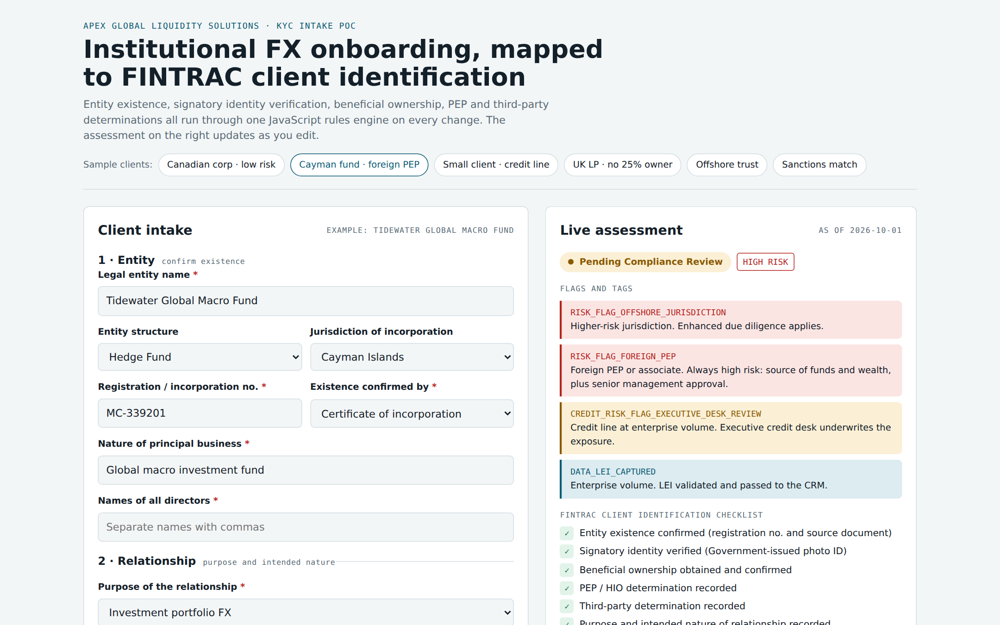
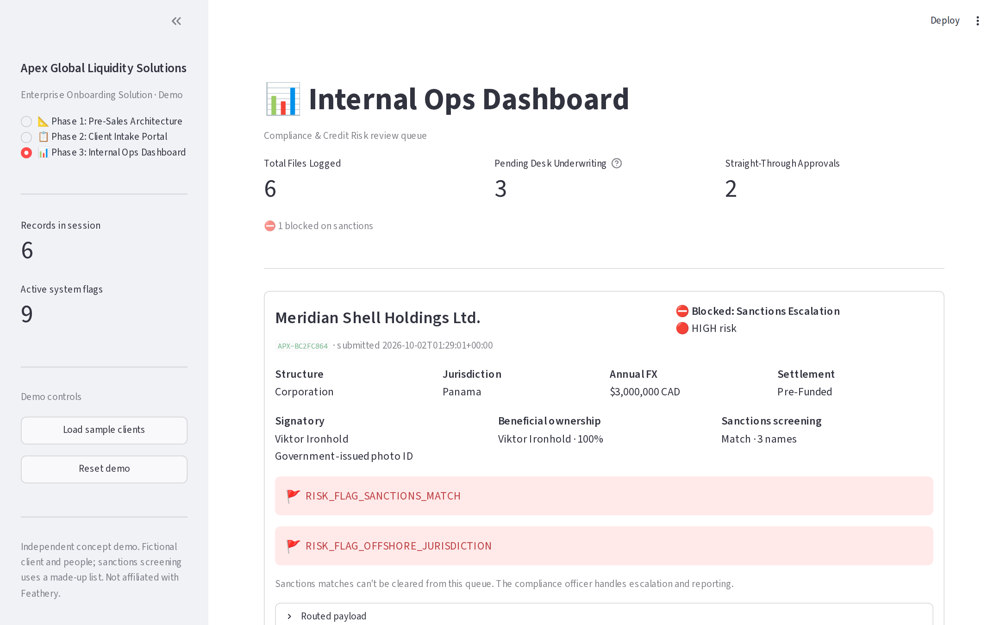

# Apex KYC Onboarding Demo

A pre-sales and post-sales proof of concept for onboarding an institutional FX client, with know-your-client (KYC) data collection mapped to FINTRAC's client identification requirements for money services businesses.

The client, **Apex Global Liquidity Solutions**, is fictional. The demo walks through what a solutions engineer would build for a prospect like it: the architecture and data contract, a working intake portal, and the internal review queue that compliance and credit teams would use.

**Try it in your browser:** open [`web/index.html`](web/index.html) via GitHub Pages (see below), or run the Streamlit app locally.



*The browser version: each sample client runs through the JavaScript rules engine, and the status, risk rating, flags and FINTRAC checklist update as the form changes.*

## What it shows

| Phase | What you see |
|---|---|
| 1 · Pre-sales architecture | System flow from intake through one rules engine to three downstream webhooks (CRM, KYC/AML, credit desk), plus the JSON Schema payload contract |
| 2 · Client intake portal | A live form: entity details, signatory identity verification, beneficial ownership, PEP and third-party checks. Fields appear and become mandatory as the rules require |
| 3 · Internal ops dashboard | Review queue with risk ratings, flags, sanctions results and a manual sign-off that needs a named approver and a written reason |

| Client intake portal | Internal ops dashboard |
|---|---|
|  |  |

## FINTRAC requirements, mapped to the intake

| Requirement | How the intake captures it |
|---|---|
| Confirm the entity exists | Registration number and the source document (certificate, registry record, partnership agreement, trust deed) |
| Verify the person acting for the entity | Signatory ID by government photo ID (with authenticity and liveness check), Canadian credit file, or dual-process |
| Beneficial ownership | Names and addresses of individuals owning or controlling 25%+; directors; trustees, settlors and beneficiaries for trusts; how ownership was confirmed |
| Ownership can't be confirmed | Verify the CEO (or equivalent) and treat the client as high risk |
| PEP / HIO determination | Recorded for the signatory and every beneficial owner |
| Third-party determination | Yes or no, with name and relationship |
| Purpose and intended nature | Purpose, expected annual volume and settlement structure |
| High-risk clients | Source of funds and wealth required; senior management approval flagged |
| Record keeping | Every payload notes the 5-year retention rule |

## How the rules work

One rules engine, written twice so it can run anywhere: [`app.py`](app.py) (Python) and [`rules-engine.js`](rules-engine.js) (JavaScript). Both produce identical payloads for the same input.

**Flags** decide which team reviews a file:

| Condition | Flag | Result |
|---|---|---|
| Name matches the sanctions watchlist | `RISK_FLAG_SANCTIONS_MATCH` | Blocked; CRM on hold; compliance officer escalation |
| Cayman Islands or Panama | `RISK_FLAG_OFFSHORE_JURISDICTION` | High risk; enhanced due diligence |
| Foreign PEP or associate | `RISK_FLAG_FOREIGN_PEP` | High risk; senior management approval |
| Domestic PEP, HIO or associate | `RISK_FLAG_PEP_HIO_REVIEW` | Compliance review |
| Ownership not confirmed | `RISK_FLAG_BO_UNCONFIRMED` | High risk; CEO verified instead |
| Acting for a third party | `RISK_FLAG_THIRD_PARTY` | Compliance review |
| Any post-trade credit line | `CREDIT_RISK_FLAG_DESK_REVIEW` | Credit desk underwrites |
| Credit line at $10M+ CAD | `CREDIT_RISK_FLAG_EXECUTIVE_DESK_REVIEW` | Executive credit review |

**Status** resolves in a fixed order: a sanctions match blocks, compliance review comes before credit, and only a file with no flags is approved straight through. **Tags** such as `DATA_LEI_CAPTURED` are informational and never block approval.

## Design decisions

- **One rules layer before fan-out.** Every downstream system receives the same validated payload, and a rule changes in one place.
- **Pure functions.** The rules take plain data and return plain data, with no UI code. That is what let them be ported from Python to JavaScript unchanged, and it means a server can re-run the same checks the browser did.
- **Data minimization.** Fields are only kept when their rule applies. Owners under 25% and identity fields for unused verification methods are dropped from the payload.
- **Controls on overrides.** Sign-off needs a named approver and a reason, keeps the cleared flags as an audit trail, and can't clear a sanctions match.

## Run it

**Browser version** (no install): open `web/index.html` in any browser.

**Streamlit app:**

```bash
python3 -m venv .venv
source .venv/bin/activate
pip install -r requirements.txt
streamlit run app.py
```

Click **Load sample clients** in the sidebar to fill the ops dashboard with six scenarios.

**JavaScript rules engine** (needs [Node.js](https://nodejs.org)):

```bash
node rules-engine.js
```

**Tests:**

```bash
pip install -r requirements-dev.txt
pytest -q tests
```

The rule tests check routing and risk for every sample client, credit and LEI handling, ID expiry and the 25% ownership cut-off. A parity test runs the JavaScript engine through Node.js and checks it returns the same status, risk rating, flags and tags as the Python engine for every sample client. GitHub Actions runs both on every push.

### Publish the browser version with GitHub Pages

In this repository: **Settings → Pages → Build and deployment**, choose **Deploy from a branch**, pick `main` and the `/ (root)` folder, then save. The demo will be live at `https://jackrekrutiak.github.io/apex-kyc-onboarding-demo/web/`.

## Project structure

```
app.py              Streamlit app: all three phases + Python rules engine
rules-engine.js     The same rules in JavaScript, with a runnable demo
web/index.html      Browser version: intake form driven by the JS engine
tests/              Rule tests and the JavaScript/Python parity test (pytest)
docs/               Screenshots
requirements.txt
```

## Scope

This is a concept demo built for a job application. Apex Global Liquidity Solutions and every person shown are fictional, and sanctions screening uses a made-up list. It maps onboarding data to FINTRAC client identification requirements; an intake form alone does not make a firm FINTRAC compliant, which also takes a compliance officer, written policies, a risk assessment, training, ongoing monitoring and transaction reporting.

Not affiliated with or endorsed by Feathery or any other company.

## License

MIT. See [LICENSE](LICENSE).
